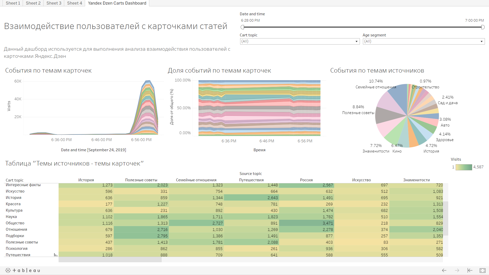

# Анализ взаимодействия пользователей с карточками в Яндекс.Дзен
Созданный дашборд обеспечил информацией регулярные повторяющиеся запросы коллег. Дашборд имеет 4 разные визуализации. Настраивается при помощи фильтров. Также для коллег была подготовлена презентация, которая знакомит с дашбордом.

## Статус
Проект закончен

## Задачи
- Выгрузить данные из БД в csv-файл
- Создать дашборд в Tableau

## Вывод
Был построен дашборд, позволяющий в любой момент получить ответы на возникающие вопросы.  

Превью (активная ссылка на Tableau Public):  
  

## Использованные инструменты
Базовые инструменты: python, pandas  
Взаимодействие с БД: sqlalchemy  
Создание дашборда: Tableau  

Проект выполнен в Jupyter Notebook
